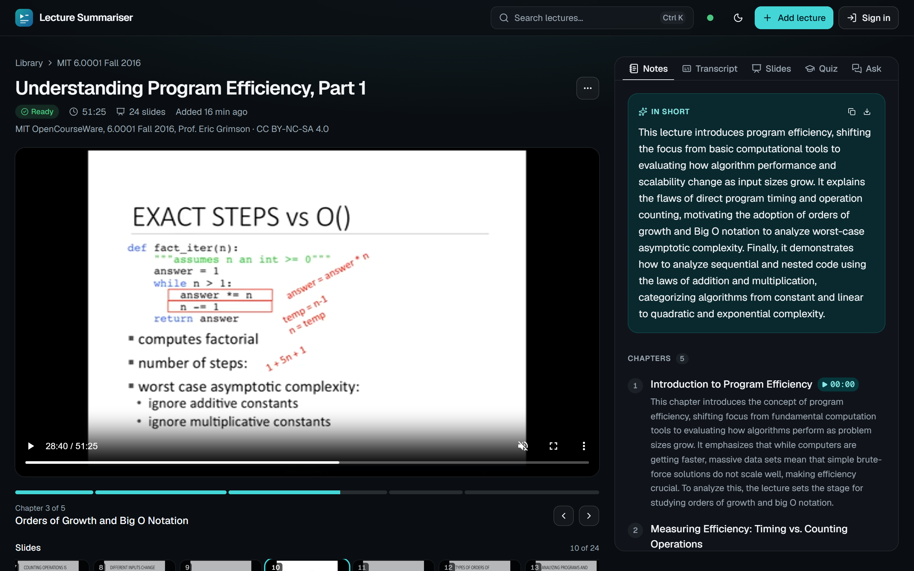
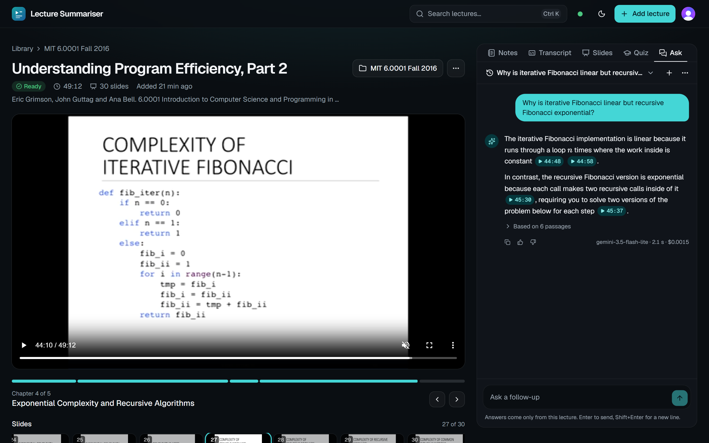
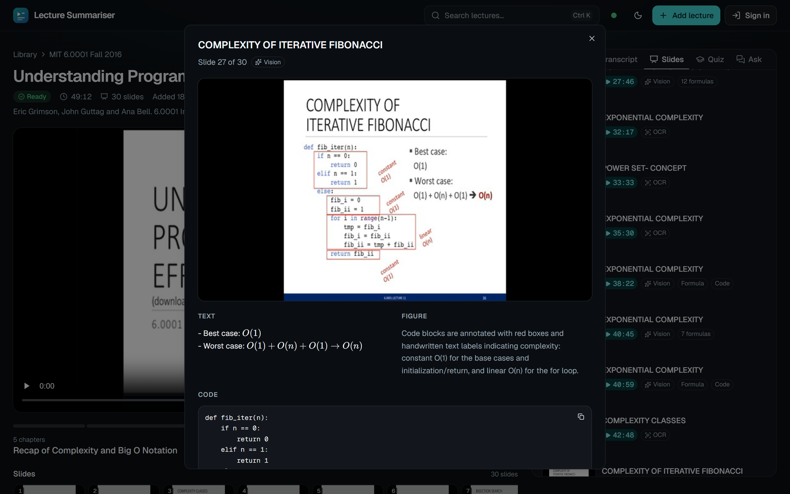
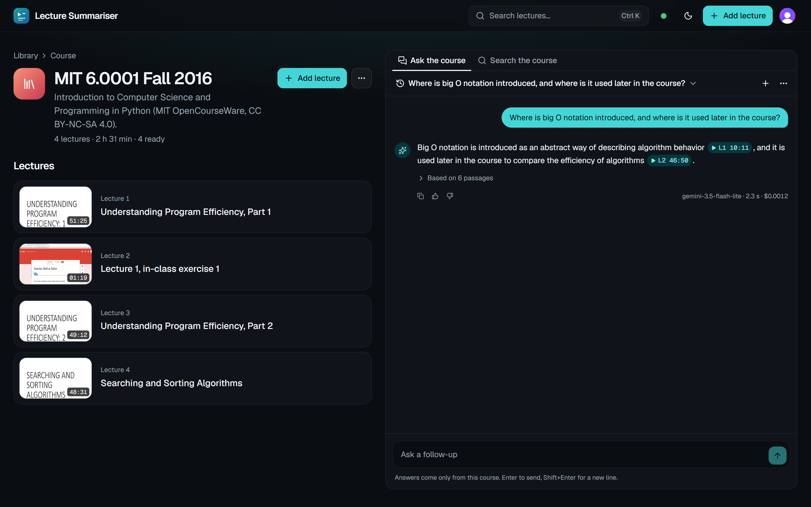
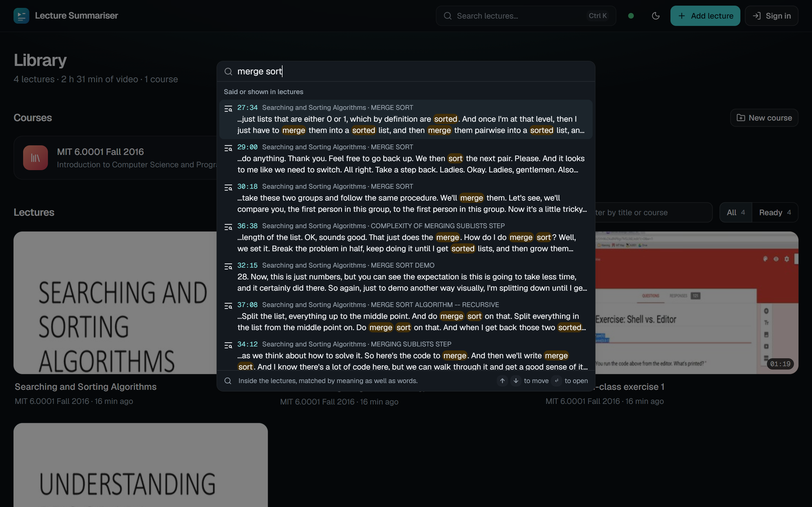
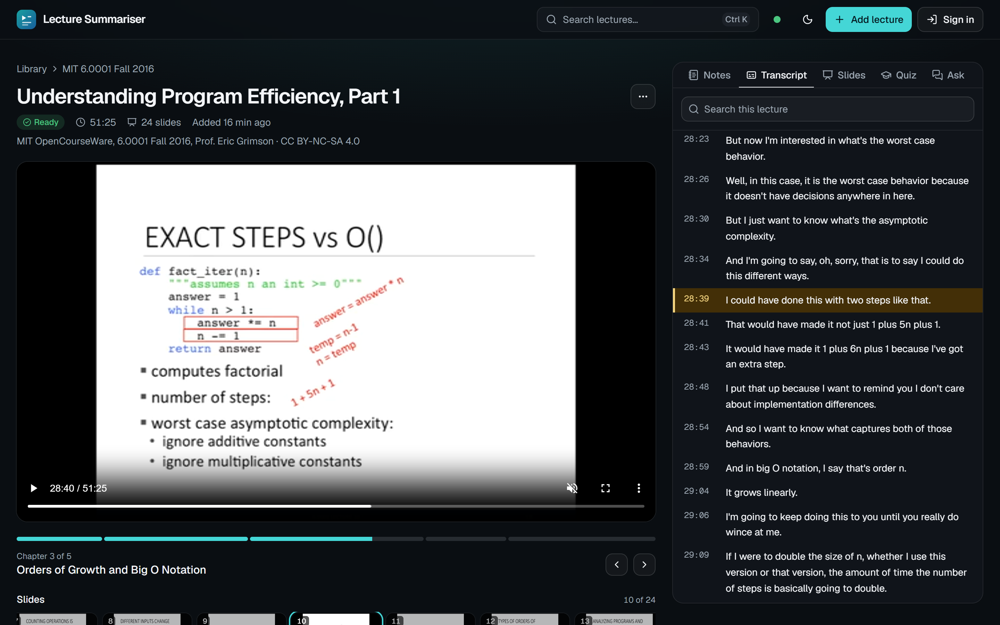
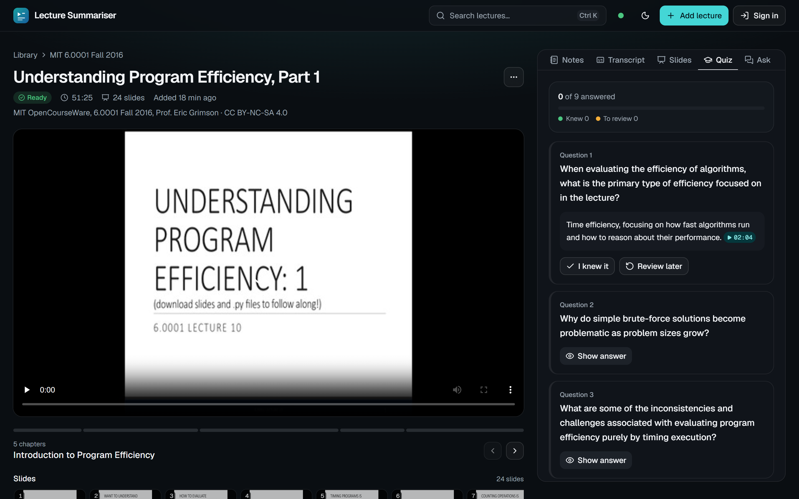
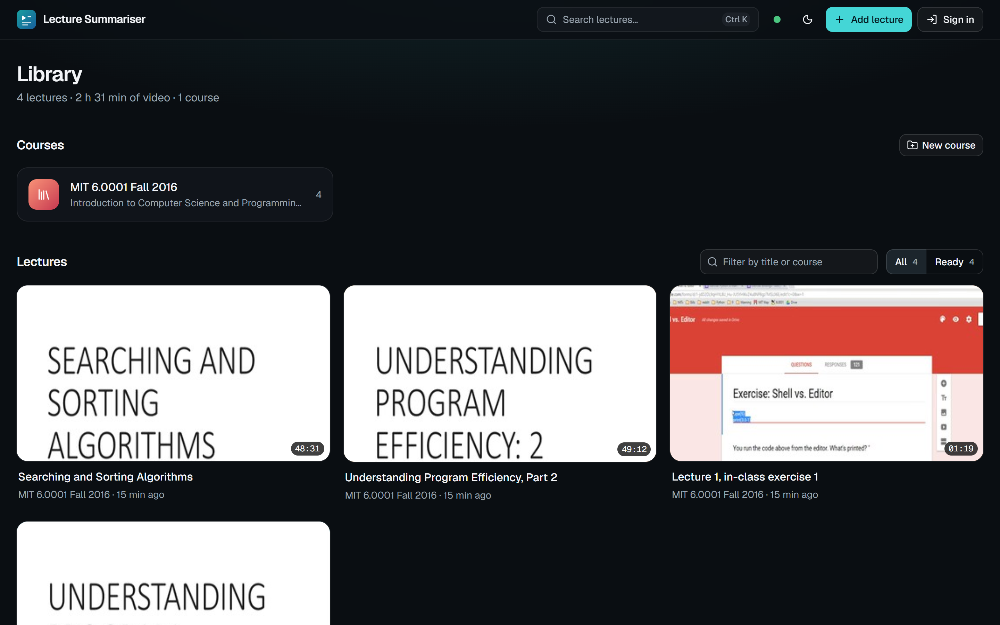
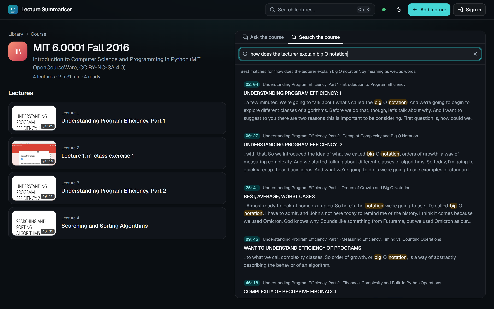
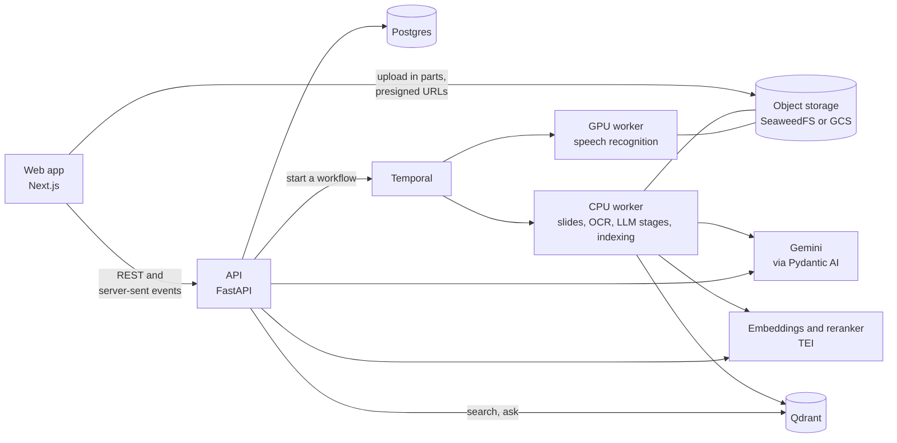

# Lecture Summariser

Turns lecture videos into study material: a transcript and slides in step with the video,
chapters, study notes and a quiz, search, and a Q&A chat whose answers cite the moment in the
lecture they come from, about one lecture or a whole course.



## Quick start

**Run it on your machine.** You need Docker (on Windows, inside WSL2), make, an NVIDIA GPU for
speech recognition, and a [Gemini API key](https://aistudio.google.com/apikey):

```bash
git clone https://github.com/leon2378/multimodal-educational-video-summarisation.git lecture-summariser
cd lecture-summariser
echo 'GEMINI_API_KEY=<your key>' > .env
make speech-model up app gpu-worker   # the speech model (1.6 GB), then the whole stack in Docker
```

Open http://localhost:3000 and add a lecture: drop a video file, or paste a link to one, such
as an MIT OpenCourseWare lecture on YouTube. A 50-minute lecture is ready to study in about two
minutes. The first run downloads the images and models, several GB. Locally, sign-in is off:
you're the only user, with no limits.

**Put the demo online** for a session, once its [one-time setup](#deploying-the-demo) is done:

```bash
make deploy tag=v0.6.9   # a Google Cloud VM with the whole stack, up in about 10 minutes
make destroy             # delete it after; it costs about $0.07 an hour while it exists
```

## What it does

- **Add a lecture**: drop a video in the browser, which uploads it straight to storage in parts
  and resumes an interrupted upload, or paste a link (YouTube, Vimeo, a Zoom share and the many
  other sites yt-dlp knows).
- **Processing**: speech recognition on a GPU, slide detection, and OCR on every slide, with a
  vision LLM for the slides OCR can't read (figures, annotations, tables, code beside notes).
  Then chapters, study notes, formulas and a quiz, each tied to a timestamp. A Temporal
  workflow runs the stages on CPU and GPU workers, and each stage's output is cached by its
  inputs, so processing again only redoes what changed.
- **Studying**: the lecture page plays the video beside tabs for the notes, a transcript that
  follows playback, the slides (formulas typeset where the text has them), a quiz and Ask.
  Every timestamp plays the video from there.
- **Search**: dense vectors and BM25, fused, then reranked, within a lecture, across a course,
  or over the whole library from Ctrl+K.
- **Q&A**: answers stream in citing `[mm:ss]`, and each citation is checked against what was
  retrieved. A question about the lecture's order or the whole of it is answered from its
  chapters, and a follow-up is rewritten to stand on its own. Across a course, citations name
  the lecture: `[L2 12:34]`.
- **Accounts**: Clerk sign-in. Visitors read and search the public lectures; signed-in users ask
  and upload their own, private lectures within daily quotas, under a daily ceiling on LLM
  spend.
- **Measured**: eval suites score speech recognition, notes, slide reading, search and answers,
  and gate every change in CI. Traces, metrics and logs go to Grafana, and every answer and
  processing run records what its LLM calls cost.

## Screenshots

| | |
|:---:|:---:|
| <br>Ask about a lecture: each citation plays the video from there | <br>A slide as the vision model read it, with its formulas, code and figure |
| <br>Ask a whole course: citations name the lecture | <br>Search what was said and shown, from Ctrl+K |
| <br>The transcript follows playback | <br>A quiz, each answer linked to where it's taught |
| <br>The library | <br>Search across a course's lectures |

The lectures are MIT OpenCourseWare's 6.0001, Fall 2016 (CC BY-NC-SA 4.0).

## How it works



The browser uploads the video straight to object storage and asks the API to process it. The
API starts a Temporal workflow, whose stages run on a CPU worker (slide detection, OCR, the LLM
stages, embedding and indexing) and a GPU worker (speech recognition); the results land in
Postgres and Qdrant. Each stage's output is stored under a key made from its inputs, version and
settings, so changing a prompt re-runs only the stages after it. A question is searched (dense
and BM25, fused and reranked), answered by Gemini from the passages found and the lecture's
outline, and every `[mm:ss]` in the answer is checked against them.

Built with Python 3.12 (FastAPI, Pydantic AI, SQLAlchemy, Temporal), Next.js 16 with shadcn/ui,
Postgres, Qdrant and S3 storage; faster-whisper for speech, RapidOCR, and Text Embeddings
Inference serving Qwen3-Embedding-0.6B and bge-reranker-v2-m3; Gemini for the LLM calls;
Terraform on Google Cloud and Modal for the demo's GPUs; OpenTelemetry into Grafana.

Each stage, and what it learned on the way, is in [docs/architecture.md](docs/architecture.md).
The original plan is [docs/blueprint.md](docs/blueprint.md), and the decisions are in
[docs/adr](docs/adr/README.md).

## Results

On MIT 6.0001 Lecture 10 (51 minutes), the lecture with eval datasets, as the CI eval gate
scored the latest release:

| | |
|---|---|
| Speech recognition | 2.8% word error rate against the human captions, about 45 times real time on a laptop RTX 3060 |
| Study notes | 9 of 10 checkable concepts cited within 10 s of where they're said. One Gemini call on the whole video: 3 of 4, at five times the cost |
| Slide text | word F1 0.86 against the slide PDF |
| Search | Recall@5 0.97 with hybrid search, 1.00 with the reranker, on 33 golden questions |
| Answers | correct 1.00 and faithful 1.00 by an LLM judge, citations inside what was retrieved 1.00 and near the answer 0.97, on 36 questions; all 3 the lecture doesn't cover declined |
| Cost | about $0.04 of LLM calls to process the lecture, and $0.0015 an answer, at Gemini's paid-tier prices |

The comparisons behind each choice are in [docs/results.md](docs/results.md): the pipeline
against a single Gemini call, three ways of reading slides, a trained frame detector against a
simple rule, and speed benchmarks of every self-hosted model.

## Running it locally

Develop inside WSL2 (Ubuntu), with the repo on the Linux filesystem (e.g.
`~/code/lecture-summariser`, not under `/mnt/c/...`, which is slow and breaks file watching).
You need Docker Desktop with WSL integration on, uv
(`curl -LsSf https://astral.sh/uv/install.sh | sh`), make, and Node 24 only to work on the web
app outside Docker.

```bash
make install        # Python dependencies (uv picks Python 3.12) and git hooks
make speech-model   # the speech model, pinned and checked
make up             # Postgres, SeaweedFS, Temporal, Qdrant and the embedding server
make app            # the API, the web app and the CPU worker in Docker: http://localhost:3000
make gpu-worker     # speech recognition and the reranker, on the GPU
```

No settings are needed beyond `GEMINI_API_KEY` in `.env`: the defaults match the Compose stack,
and [.env.example](.env.example) lists what can change. The API's docs are at
http://localhost:8000/docs, the Temporal UI at http://localhost:8233, and SeaweedFS's file
browser at http://localhost:8888.

To work on it with reloads: `make api` (the API on the host), `make worker` (a CPU worker on
the host) and `make web` (the web app, Node 24), alongside `make up`. After changing the API,
`make openapi` regenerates the web app's typed client; CI fails if it's out of date.

`make process video=data/lectures/lecture.mp4 title="..."` runs the same stages on a local file,
with no API, database or Temporal, and writes the notes as `notes.md` and `result.json` under
`data/pipeline-runs/`. Without a GPU, speech recognition runs on the CPU
(`uv sync --extra asr`, then `uv run lecture-process ...`): about 16 minutes for a 51-minute
lecture.

## The API

The web app does everything through the API, and http://localhost:8000/docs lists every
endpoint. The main flow, from the shell:

```bash
# Create a lecture: the response has a presigned URL to upload the file to, straight to storage.
curl -s -X POST localhost:8000/v1/lectures -H 'Content-Type: application/json' \
  -d '{"title": "Test lecture", "filename": "lecture.mp4", "content_type": "video/mp4"}'
curl -X PUT -H 'Content-Type: video/mp4' --data-binary @lecture.mp4 "$UPLOAD_URL"
curl -s -X POST "localhost:8000/v1/lectures/$ID/complete-upload"

curl -s -X POST "localhost:8000/v1/lectures/$ID/process"   # GET .../events streams the progress
curl -s "localhost:8000/v1/lectures/$ID/notes"             # also /transcript, /slides, /timeline, /runs
curl -s "localhost:8000/v1/search?q=why+are+constants+ignored&lecture_id=$ID"
curl -sN -X POST "localhost:8000/v1/lectures/$ID/ask" -H 'Content-Type: application/json' \
  -d '{"question": "Why do we ignore constants in big O notation?"}'
```

- **Uploads in parts**, which resume: `POST /v1/lectures/{id}/upload-parts` with the file's
  size returns a URL for each 16 MiB part, and asking again lists the parts that arrived
  ([ADR 0012](docs/adr/0012-resumable-uploads-in-parts.md)).
- **From a link**: `POST /v1/lectures/from-url`. The worker downloads it first, in a process of
  its own that can only reach the public internet
  ([ADR 0011](docs/adr/0011-lectures-from-any-link.md)). Downloading from YouTube goes against
  its terms, and copyright stays with the owner, which is on whoever gives the link. YouTube
  often refuses servers: such a link fails with the reason, and the optional
  `YOUTUBE_COOKIES_B64` and `YOUTUBE_PROXY` settings get round some of that.
- **Search** takes `mode`: `dense`, `bm25`, `hybrid` or `rerank` (the default, `SEARCH_MODE`, is
  `rerank` in Docker and `hybrid` for an API run on the host).
- **Answers** stream as server-sent events: `start`, `sources`, `delta`s of text, then `done`
  with the saved answer and its checked citations. Pass `thread_id` to ask a follow-up;
  `POST /v1/feedback` rates an answer.
- **Courses**: `POST /v1/courses`, then set a lecture's `course_id`. `GET /v1/search?course_id=`
  and `POST /v1/courses/{id}/ask` work across its lectures, citing them by their number in the
  course, as `[L2 12:34]`.

## Sign-in and quotas

Sign-in is off until the API has an issuer to trust: every request is then one user who can do
everything. Set `AUTH_ISSUER` to a Clerk instance's Frontend API URL and the API checks Clerk's
session tokens against its published keys, holding no Clerk secret
([ADR 0009](docs/adr/0009-clerk-sign-in-and-quotas.md)).

| | Without an account | Signed in | Admin (`ADMIN_USERS`) |
|---|---|---|---|
| Read and search the public lectures | yes | yes | yes |
| Ask questions | no | 30 a day, 5 a minute | no limit |
| Upload lectures (a file or a link), private to you | no | 3 a day, up to 1 GB each | no limit |
| Make courses | no | private ones | public ones too |
| Make a lecture public | no | no | yes |
| Delete a lecture | no | your own | any |

Everyone together stops at $2 of LLM spend a day (at paid-tier prices), after which questions
and processing wait for 00:00 UTC. A limit answers 429 with `Retry-After`, and `GET /v1/me`
says what the day's quotas leave. Quotas count a ledger, so deleting a lecture or a
conversation gives nothing back.

To turn it on, create a Clerk application and put in `.env`: `AUTH_ISSUER`;
`AUTH_AUTHORIZED_PARTIES`, the web app's origin (`["http://localhost:3000"]` locally);
`NEXT_PUBLIC_CLERK_PUBLISHABLE_KEY` and `CLERK_SECRET_KEY` for the web app; and `ADMIN_USERS`,
your own Clerk user id. Then `make app` rebuilds the API and the web app.

## Deploying the demo

The demo runs on Google Cloud only while it's needed
([ADR 0010](docs/adr/0010-on-demand-demo-on-google-cloud-and-modal.md)). `make deploy tag=...`,
or the deploy workflow in GitHub Actions, makes one VM that runs the whole stack behind HTTPS at
`https://<its IP, with dashes>.sslip.io`, which needs no domain, and loads the public lectures
from the stage cache, so nothing is transcribed or sent to an LLM again. Uploads are transcribed
on a GPU in Modal. `make destroy` deletes the VM; the bucket with the videos and the stage cache
stays.

Pushing a version tag (`v0.6.9`) builds the API, worker and web images, scans them for known
vulnerabilities (the exceptions, with reasons, are in `.grype.yaml`) and pushes them to GHCR. Run
by hand from Actions, the release workflow only builds and scans. Deploying another release
replaces the VM.

The first time (with the Google Cloud CLI, Terraform and a Modal account):

1. `gcloud auth login` and `gcloud auth application-default login`; copy
   `infra/terraform/cloud.tfvars.example` to `cloud.tfvars` and name your project in it. Set a
   budget alert on its billing account.
2. `make cloud-base`: the APIs Terraform needs, Terraform's state bucket, then the bucket,
   secrets, network and deploy access.
3. Modal: `uv run modal token new`, `make modal-model` once, then `make modal`; and a proxy auth
   token for the embedding server, from Modal's dashboard.
4. Copy `infra/cloud.env.example` to `infra/cloud.env`, fill it in (Gemini, Clerk, Modal) and run
   `make cloud-secrets`.
5. With the local stack running and the lectures processed, `make cloud-seed` copies the public
   lectures and the stage cache to the bucket. If the pipeline changed since, process them again
   first (only the changed stages run), or the VM recomputes them on its first boot.
6. On GitHub, add the repository variables `CLERK_PUBLISHABLE_KEY` and, from `make cloud-base`'s
   outputs, `GCP_PROJECT_ID`, `GCP_REGION`, `GCP_WORKLOAD_IDENTITY_PROVIDER` and `GCP_DEPLOYER`.
   Push a tag; once its release has run, make the three `lecture-summariser-*` packages public
   so the VM can pull them.

## Evals

The suites score the running stack through the API, as a user would reach it, on MIT 6.0001
Lecture 10:

| Suite | What it measures | Against |
|---|---|---|
| `retrieval` | Recall@5, MRR@10 and nDCG@10 for each search mode | 33 golden questions with answer spans |
| `answers` | correctness and faithfulness (an LLM judge), citations inside the retrieved passages and near the answer, declining what the lecture doesn't cover, time to first token | the same questions, plus 3 the lecture doesn't answer |
| `asr` | word error rate, recall of 34 technical terms, real-time factor | the human captions |
| `notes` | concepts cited within 10 s of where they're said, timestamp and chapter checks | the human captions |
| `slides` | word precision, recall and F1 of the slide text, by reader, and slides without a title | the lecture's slide PDF |

```bash
make eval                                 # every suite; exits 1 if a metric is past its threshold
uv run lecture-eval --suites asr,notes    # some of them
uv run lecture-eval --prepare --gate      # on a fresh stack: fetch the media, process the lecture, gate
```

Each run prints a summary, writes every question, answer and verdict to `data/evals/`, and
records an `eval_runs` row (the dataset's hash, the commit, the models, the metrics).
`evals/thresholds.json` holds the bounds the gate checks. In CI, `.github/workflows/eval.yml`
runs the same gate on GitHub's runner, without a GPU or the reranker, on pushes that could change
a score and every Monday; the stage cache carries over, so a run takes about 9 minutes and
about $0.12 of Gemini calls. It needs a `GEMINI_API_KEY` repository secret.

The captions and slide PDF aren't in git; each dataset names its files with their URL and
SHA-256, and `--prepare` downloads them. The answer judge isn't calibrated against hand grades
yet, so its scores are a trend, and the golden questions, drafted from the captions, still need
checking by hand against the video.

## Observability

```bash
make observability                         # Grafana, Tempo, Prometheus and Loki in one container
echo 'OTEL_ENDPOINT=http://otel-lgtm:4318' >> .env
make app && make gpu-worker                # recreate the services with the setting
```

Grafana is on http://localhost:3001. Its dashboard tracks the blueprint's targets (time to
first token, LLM cost and processing time per lecture-hour, answers rated helpful), the LLM
tokens and cost by stage and model, each stage's time and cache hits, the API, and every eval
run. Each request is one trace, from the API through the workflow's activities to each LLM call
with its prompt and reply. Setting `LANGFUSE_PUBLIC_KEY` and `LANGFUSE_SECRET_KEY` also sends the
LLM calls to Langfuse ([ADR 0006](docs/adr/0006-opentelemetry-to-grafana-and-langfuse.md)).

## Commands

| Command | What it does |
|---|---|
| `make speech-model` | Download the speech model into `data/models/` and check it |
| `make up` / `make down` | Start or stop Postgres, SeaweedFS, Temporal, Qdrant and the embedding server, on the GPU if `nvidia-smi` finds one (`make reset` also deletes their data) |
| `make app` | Build and run the API, the web app and the CPU worker in Docker |
| `make gpu-worker` | Build and run speech recognition and the reranker on the GPU |
| `make api` / `make worker` / `make web` | Run the API, a CPU worker or the web app on the host, with reloads |
| `make process video=... title=...` | Run the pipeline on a local file, without the API |
| `make openapi` | Regenerate the web app's typed API client after an API change |
| `make eval` / `make eval-retrieval` | Run every eval suite and check the thresholds / score search only |
| `make observability` | Start Grafana with traces, metrics and logs on http://localhost:3001 |
| `make detector-data` / `make detector-train` | Label frames for the frame detector from the lectures' slide PDFs / fine-tune it |
| `make bench` | Benchmark speech recognition, the embedding model and the frame detector |
| `make modal-model` / `make modal` | The speech model into Modal / deploy speech recognition and embeddings to Modal's GPUs |
| `make cloud-base` / `make cloud-secrets` / `make cloud-seed` | Set up the demo in Google Cloud: its bucket, network and access / secrets / lectures |
| `make deploy tag=...` / `make destroy` | Make the demo's VM for a release, or delete it |
| `make migrate` / `make revision m="..."` | Apply migrations / generate one after changing the models |
| `make test` / `make test-unit` | All tests / unit tests only |
| `make lint` / `make fmt` / `make typecheck` / `make audit` | Ruff / Ruff fix and format / mypy (strict) / pip-audit |
| `make check` | Lint, type-check and test, as CI does |

## Layout

```
apps/api/            FastAPI service: routes, schemas, sign-in, quotas, the demo's export and load
apps/web/            Next.js web app (shadcn/ui), with a typed client generated from openapi.json
packages/core/       settings, SQLAlchemy models, Alembic migrations, storage, the timeline and notes formats
packages/perception/ media, slide detection, OCR, speech recognition, downloads from links
packages/llm/        Pydantic AI agents: reading slides, chapters, notes, answers
packages/pipeline/   stages, the stage cache, a local runner, the Temporal workflow and workers
packages/rag/        chunks, embeddings (TEI, BM25), the Qdrant index, hybrid search
evals/               eval suites (lecture-eval), datasets, thresholds, the Gemini baseline
ml/detector/         the frame detector: labels from slide PDFs, dataset, RF-DETR training
ml/bench/            speed benchmarks (lecture-bench)
prompts/             versioned prompts for the pipeline, Q&A and evals
infra/               Compose files, Dockerfiles, Grafana, Caddy, Modal and Terraform
tests/               unit tests, and integration tests on real services in containers
docs/                architecture, results, blueprint, ADRs and screenshots
```

## Tests

`make test` runs everything. Integration tests are marked `integration` and start real
Postgres, SeaweedFS, Temporal and Qdrant with testcontainers, then drive the whole flow through
the API; they need Docker but not `make up`, and are skipped locally if Docker isn't running (in
CI they must run). One of them runs `alembic check`, which fails if a model changed without a
migration. CI also lints, type-checks, builds the web app and the images, and audits the
dependencies, with every action pinned to a commit.

## Design decisions

The decisions are recorded in [docs/adr](docs/adr/README.md). Where the build departs from
the blueprint:

- **Slides go to the vision LLM by a rule, not the frame detector.** OCR reads every slide, and
  the vision LLM only those with ink outside the text, angled lines, text side by side or
  doubtful OCR. The trained detector finds slides and people, but routes slides worse than the
  rule (F1 0.79 against 0.85), so it isn't in the pipeline.
- **The reranker and the embedding model run on the GPU locally.** On a laptop CPU the
  reranker took 77 s a query, and the CPU embedding server can return a wrong vector when
  requests overlap ([ADR 0008](docs/adr/0008-where-the-models-run.md)).
- **The player streams the uploaded MP4** with range requests, not HLS renditions.
- **The search index doesn't store course ids**: a course search filters by its lectures' ids,
  so a lecture can move between courses without re-indexing.
- **The eval gate runs every suite in CI**, on the CPU, instead of a subset on pull requests and
  the rest nightly: the stage cache makes it cheap enough.
- **No permanent demo, and no Vercel**: the web app runs on the demo's VM, next to the API, and
  the VM exists only for a session.
- **The demo's Q&A needs an account**, so every LLM call belongs to a user with a quota.
- **No MLflow**: eval runs are in Postgres and Grafana, and the few training runs and
  benchmarks are files under `data/`.
- **No dependency bot opening pull requests**: dependencies are updated by hand
  (`uv lock --upgrade`), and CI audits the lockfile on every push.

## Status

Built in six phases ([docs/blueprint.md](docs/blueprint.md)): the foundation; the pipeline and
the web app; search and Q&A; evals and observability; OCR routing, the frame detector and speed
benchmarks; and shipping, with sign-in, quotas and the cloud demo, which has been deployed and
tested. Not built yet:

- HLS streaming, for other formats and adaptive bitrate.
- An endpoint to re-run one stage (processing again re-runs only what changed already).
- Turning answers rated unhelpful into eval cases.
- The frame detector in the pipeline, until it routes as well as the rule.
- An ADR for running at scale: managed services, and GPU workers scaled on the queue.
- An export of the demo that leaves out private lectures' cached results.

## Data and licensing

`make speech-model` downloads the speech model (faster-whisper large-v3-turbo, 1.6 GB, MIT
licence) at the revision the code expects and checks its SHA-256. The embedding model
(Qwen3-Embedding-0.6B) and the reranker (bge-reranker-v2-m3), both Apache-2.0, download into a
Docker volume the first time their containers start, pinned to the revisions in
`infra/compose.yaml`.

Lecture videos never go in git. MIT OpenCourseWare material is CC BY-NC-SA 4.0: each lecture
records its licence and attribution, and the demo is non-commercial. The golden questions were
written for this project about those lectures, with each lecture's attribution in its file.
