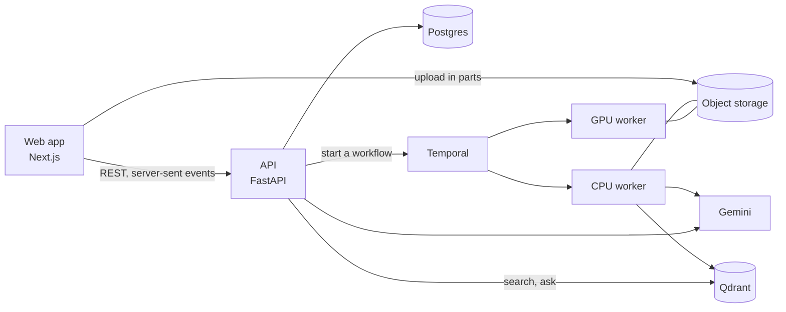
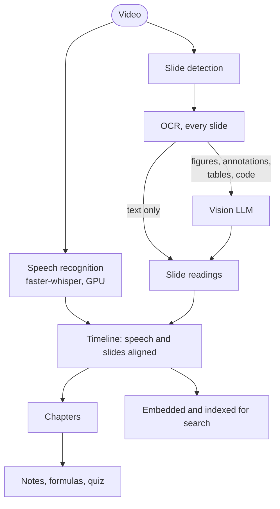

# Lecture Summariser

[](https://github.com/leon2378/multimodal-educational-video-summarisation/actions/workflows/ci.yml)
[](https://github.com/leon2378/multimodal-educational-video-summarisation/actions/workflows/eval.yml)
[](https://github.com/leon2378/multimodal-educational-video-summarisation/tags)

Turns lecture videos into study material: a transcript and slides in step with the video,
chapters, study notes and a quiz, search, and a Q&A chat whose answers cite the moment in the
lecture they come from, about one lecture or a whole course.


## Quick start

**Run it on your machine.** You need Docker (on Windows, inside WSL2), make, an NVIDIA GPU for
speech recognition, and a [Gemini API key](https://aistudio.google.com/apikey):

```bash
git clone https://github.com/leon2378/multimodal-educational-video-summarisation.git lecture-summariser
cd lecture-summariser
echo 'GEMINI_API_KEY=<your key>' > .env
make speech-model up app gpu-worker   # the speech model (1.6 GB), then the whole stack in Docker
```

Open http://localhost:3000 and add a lecture: drop a video file, or paste a link to one, such
as an MIT OpenCourseWare lecture on YouTube. A 50-minute lecture is ready in about two minutes;
the first run also downloads the images and models, several GB. Locally, sign-in is off.

**Put the demo online** for a session, once its [one-time setup](#deploying-the-demo) is done:

```bash
make deploy tag=v0.6.9   # a Google Cloud VM with the whole stack, up in about 10 minutes
make destroy             # delete it after; it costs about $0.07 an hour while it exists
```

## Features

- **Any lecture in**: drop a video, which uploads straight to storage in parts and resumes if
  interrupted, or paste a link: YouTube, Vimeo, a Zoom share and the many sites yt-dlp knows.
- **Processed in minutes**: speech recognition, the slides found and read, then chapters, study
  notes, formulas and a quiz, each tied to a timestamp.
- **Study in step with the video**: the notes, a transcript that follows playback, the slides
  with their formulas typeset, and a quiz. Every timestamp plays the video from there.
- **Search**: dense and keyword search, fused and reranked, in a lecture, a course or the whole
  library (Ctrl+K).
- **Ask, with citations**: streamed answers cite `[mm:ss]`, each citation checked against what
  was retrieved; follow-ups are understood; a whole course can be asked, citing `[L2 12:34]`.
- **Accounts**: public demo lectures, private uploads, daily quotas and a daily LLM budget.
- **Measured**: eval suites gate every change in CI, and Grafana shows the time and cost of
  every answer and processing run.

## Screenshots

| | |
|:---:|:---:|
| <br>Ask about a lecture: each citation plays the video from there | <br>A slide as the vision model read it, with its formulas, code and figure |
| <br>Ask a whole course: citations name the lecture | <br>Search what was said and shown, from Ctrl+K |
| <br>The transcript follows playback | <br>A quiz, each answer linked to where it's taught |
| <br>The library | <br>Search across a course's lectures |

The lectures are MIT OpenCourseWare's 6.0001, Fall 2016 (CC BY-NC-SA 4.0).

## How it works



What a lecture goes through, one Temporal activity per stage:



- **Cached by stage**: each stage's output is stored under a key made from its inputs, version
  and settings, so a changed prompt re-runs only the stages after it.
- **OCR first**: the vision LLM reads only the slides OCR can't, at about half the cost of
  reading them all, and with fewer slides left untitled.
- **Grounded answers**: a question is searched, answered from the passages found and the
  lecture's outline, and every `[mm:ss]` in the answer is checked against them.

| | Built with |
|---|---|
| **Web** | Next.js 16, shadcn/ui, KaTeX |
| **API** | FastAPI, SQLAlchemy and Alembic on Postgres, Clerk |
| **Processing** | Temporal, faster-whisper, PyAV, RapidOCR, Pydantic AI with Gemini |
| **Search** | Qdrant, Text Embeddings Inference (Qwen3-Embedding-0.6B, bge-reranker-v2-m3), BM25 |
| **Infrastructure** | Docker Compose, SeaweedFS, Terraform on Google Cloud, Modal GPUs, GitHub Actions |
| **Quality** | eval suites with an LLM judge, OpenTelemetry, Grafana, Langfuse |
| **ML** | RF-DETR frame detector; ONNX Runtime and TensorRT benchmarks |

More in [docs/architecture.md](docs/architecture.md) (each stage, and what it learned on the
way), [docs/results.md](docs/results.md), [the decisions](docs/adr/README.md) and
[the original plan](docs/blueprint.md).

## Results

On MIT 6.0001 Lecture 10 (51 minutes), the lecture with eval datasets, as the CI eval gate
scored the latest release:

| | |
|---|---|
| **Speech recognition** | 2.8% word error rate against the human captions, about 45 times real time on a laptop RTX 3060 |
| **Study notes** | 9 of 10 checkable concepts cited within 10 s of where they're said (one Gemini call on the whole video: 3 of 4, at five times the cost) |
| **Slide text** | word F1 0.86 against the slide PDF |
| **Search** | Recall@5 0.97 with hybrid search, 1.00 with the reranker, on 33 golden questions |
| **Answers** | correct 1.00 and faithful 1.00 by an LLM judge, citations inside what was retrieved 1.00 and near the answer 0.97; all 3 questions the lecture doesn't cover declined |
| **Cost** | about $0.04 of LLM calls to process the lecture, and $0.0015 an answer, at Gemini's paid-tier prices |

The comparisons behind each choice are in [docs/results.md](docs/results.md).

## Run it locally

Develop inside WSL2, with the repo on the Linux filesystem (not under `/mnt/c/`, which is slow).
You need Docker Desktop with WSL integration, [uv](https://docs.astral.sh/uv/), make, and Node
24 only to work on the web app outside Docker.

```bash
make install        # Python dependencies (uv picks Python 3.12) and git hooks
make speech-model   # the speech model, pinned and checked
make up             # Postgres, SeaweedFS, Temporal, Qdrant and the embedding server
make app            # the API, the web app and the CPU worker in Docker: http://localhost:3000
make gpu-worker     # speech recognition and the reranker, on the GPU
```

- **Settings**: only `GEMINI_API_KEY` in `.env`; the defaults match the Compose stack, and
  [.env.example](.env.example) lists the rest.
- **Working on it**: `make api`, `make worker` and `make web` run each part on the host with
  reloads; after changing the API, `make openapi` regenerates the web app's typed client.
- **Useful pages**: the API's docs on http://localhost:8000/docs, the Temporal UI on :8233.
- **Without the stack**: `make process video=... title=...` runs the pipeline on a local file and
  writes the notes as Markdown and JSON.

## Deploying the demo

`make deploy tag=...` (or the deploy workflow in GitHub Actions) makes one Google Cloud VM that
runs the whole stack behind HTTPS at `https://<its IP, with dashes>.sslip.io`, and loads the
public lectures from the stage cache, with no transcription or LLM calls. Uploads are
transcribed on a GPU in Modal. `make destroy` deletes the VM, and the bucket stays
([ADR 0010](docs/adr/0010-on-demand-demo-on-google-cloud-and-modal.md)). Pushing a version tag
builds the images, scans them for vulnerabilities and pushes them to GHCR.

<details>
<summary><b>The one-time setup</b> (Google Cloud, Modal, GitHub)</summary>

<br>

With the Google Cloud CLI, Terraform and a Modal account:

1. `gcloud auth login` and `gcloud auth application-default login`; copy
   `infra/terraform/cloud.tfvars.example` to `cloud.tfvars` and name your project in it. Set a
   budget alert on its billing account.
2. `make cloud-base`: the APIs Terraform needs, its state bucket, then the bucket, secrets,
   network and deploy access.
3. Modal: `uv run modal token new`, `make modal-model` once, then `make modal`; and a proxy auth
   token for the embedding server, from Modal's dashboard.
4. Copy `infra/cloud.env.example` to `infra/cloud.env`, fill it in (Gemini, Clerk, Modal) and run
   `make cloud-secrets`.
5. With the local stack running and the lectures processed, `make cloud-seed` copies the public
   lectures and the stage cache to the bucket. If the pipeline changed since, process them again
   first, or the VM recomputes those stages on its first boot.
6. On GitHub, add the repository variables `CLERK_PUBLISHABLE_KEY` and, from `make cloud-base`'s
   outputs, `GCP_PROJECT_ID`, `GCP_REGION`, `GCP_WORKLOAD_IDENTITY_PROVIDER` and `GCP_DEPLOYER`.
   Push a tag; once its release has run, make the three `lecture-summariser-*` packages public.

</details>

## Evals

The suites score the running stack through the API, as a user would reach it, on MIT 6.0001
Lecture 10, and `make eval` fails if a metric drops past its threshold:

| Suite | Measures | Against |
|---|---|---|
| `retrieval` | Recall@5, MRR@10 and nDCG@10 for each search mode | 33 golden questions with answer spans |
| `answers` | correctness and faithfulness (an LLM judge), citations, declining what isn't covered | the same questions, plus 3 the lecture doesn't answer |
| `asr` | word error rate, technical terms recalled, real-time factor | the human captions |
| `notes` | concepts cited near where they're said, timestamp and chapter checks | the human captions |
| `slides` | word precision, recall and F1 of the slide text | the lecture's slide PDF |

<details>
<summary><b>Running them</b>, and the gate in CI</summary>

<br>

```bash
make eval                                 # every suite, recorded in Postgres, checked against the thresholds
uv run lecture-eval --suites asr,notes    # some of them
uv run lecture-eval --prepare --gate      # on a fresh stack: fetch the media, process the lecture, gate
```

Each run writes every question, answer and verdict to `data/evals/` and records an `eval_runs`
row. In CI, `.github/workflows/eval.yml` runs the same gate on GitHub's runner, without a GPU or
the reranker, on every push that could change a score and every Monday. The stage cache carries
over, so a run takes about 9 minutes and $0.12 of Gemini calls; it needs a `GEMINI_API_KEY`
secret. The captions and slide PDF aren't in git: each dataset names its files with their URL
and SHA-256, and `--prepare` downloads them. The answer judge isn't calibrated against hand
grades yet, so its scores are a trend.

</details>

## Reference

<details>
<summary><b>The API</b>: upload, process, search and ask from the shell</summary>

<br>

http://localhost:8000/docs lists every endpoint.

```bash
# Create a lecture: the response has a presigned URL to upload the file to, straight to storage.
curl -s -X POST localhost:8000/v1/lectures -H 'Content-Type: application/json' \
  -d '{"title": "Test lecture", "filename": "lecture.mp4", "content_type": "video/mp4"}'
curl -X PUT -H 'Content-Type: video/mp4' --data-binary @lecture.mp4 "$UPLOAD_URL"
curl -s -X POST "localhost:8000/v1/lectures/$ID/complete-upload"

curl -s -X POST "localhost:8000/v1/lectures/$ID/process"   # GET .../events streams the progress
curl -s "localhost:8000/v1/lectures/$ID/notes"             # also /transcript, /slides, /timeline, /runs
curl -s "localhost:8000/v1/search?q=why+are+constants+ignored&lecture_id=$ID"
curl -sN -X POST "localhost:8000/v1/lectures/$ID/ask" -H 'Content-Type: application/json' \
  -d '{"question": "Why do we ignore constants in big O notation?"}'
```

- **Uploads in parts** resume: `POST /v1/lectures/{id}/upload-parts` with the file's size
  returns a URL for each 16 MiB part ([ADR 0012](docs/adr/0012-resumable-uploads-in-parts.md)).
- **From a link**: `POST /v1/lectures/from-url`. The worker downloads it in a process that can
  only reach the public internet ([ADR 0011](docs/adr/0011-lectures-from-any-link.md)).
  Downloading from YouTube goes against its terms, and copyright stays with the owner, which is
  on whoever gives the link. YouTube often refuses servers; such a link fails with the reason.
- **Search** takes `mode`: `dense`, `bm25`, `hybrid` or `rerank`.
- **Answers** stream as server-sent events (`start`, `sources`, `delta`s, `done`). Pass
  `thread_id` to ask a follow-up; `POST /v1/feedback` rates an answer.
- **Courses**: `POST /v1/courses`, then set a lecture's `course_id`; search and ask then work
  across its lectures.

</details>

<details>
<summary><b>Sign-in and quotas</b></summary>

<br>

Sign-in is off until `AUTH_ISSUER` names a Clerk instance; then the API checks Clerk's session
tokens against its published keys, holding no Clerk secret
([ADR 0009](docs/adr/0009-clerk-sign-in-and-quotas.md)).

| | Without an account | Signed in | Admin |
|---|---|---|---|
| Read and search the public lectures | yes | yes | yes |
| Ask questions | no | 30 a day, 5 a minute | no limit |
| Upload lectures, private to you | no | 3 a day, up to 1 GB each | no limit |
| Make courses | no | private ones | public ones too |
| Make a lecture public | no | no | yes |
| Delete a lecture | no | your own | any |

Everyone together stops at $2 of LLM spend a day, after which questions and processing wait for
00:00 UTC. To turn it on, put in `.env`: `AUTH_ISSUER`, `AUTH_AUTHORIZED_PARTIES` (the web app's
origin), `NEXT_PUBLIC_CLERK_PUBLISHABLE_KEY`, `CLERK_SECRET_KEY` and `ADMIN_USERS` (your Clerk
user id), then `make app`.

</details>

<details>
<summary><b>Observability</b></summary>

<br>

```bash
make observability                         # Grafana, Tempo, Prometheus and Loki in one container
echo 'OTEL_ENDPOINT=http://otel-lgtm:4318' >> .env
make app && make gpu-worker                # recreate the services with the setting
```

Grafana, on http://localhost:3001, tracks time to first token, LLM cost and processing time per
lecture-hour, answers rated helpful, each stage's time and cache hits, and every eval run. Each
request is one trace, from the API through the workflow's activities to each LLM call. With
`LANGFUSE_PUBLIC_KEY` and `LANGFUSE_SECRET_KEY` set, the LLM calls also go to Langfuse
([ADR 0006](docs/adr/0006-opentelemetry-to-grafana-and-langfuse.md)).

</details>

<details>
<summary><b>Commands</b></summary>

<br>

| Command | What it does |
|---|---|
| `make speech-model` | Download the speech model into `data/models/` and check it |
| `make up` / `make down` / `make reset` | Start or stop the services (on the GPU if there is one) / also delete their data |
| `make app` / `make gpu-worker` | Build and run the API, web app and CPU worker / speech recognition and the reranker |
| `make api` / `make worker` / `make web` | Run the API, a CPU worker or the web app on the host, with reloads |
| `make process video=... title=...` | Run the pipeline on a local file |
| `make openapi` | Regenerate the web app's typed API client |
| `make eval` / `make eval-retrieval` | Run the eval suites and check the thresholds / score search only |
| `make observability` | Grafana with traces, metrics and logs |
| `make detector-data` / `make detector-train` / `make bench` | Label frames and train the frame detector / benchmark the models |
| `make modal-model` / `make modal` | The speech model into Modal / deploy to Modal's GPUs |
| `make cloud-base` / `make cloud-secrets` / `make cloud-seed` | Set up the demo in Google Cloud |
| `make deploy tag=...` / `make destroy` | Make the demo's VM for a release, or delete it |
| `make migrate` / `make revision m="..."` | Apply migrations / make one after changing the models |
| `make check` | Lint, type-check and test, as CI does (`make lint`, `fmt`, `typecheck`, `test`, `audit`) |

</details>

<details>
<summary><b>Layout</b></summary>

<br>

```
apps/api/            FastAPI service: routes, schemas, sign-in, quotas, the demo's export and load
apps/web/            Next.js web app, with a typed client generated from openapi.json
packages/core/       settings, models, migrations, storage, the timeline and notes formats
packages/perception/ media, slide detection, OCR, speech recognition, downloads from links
packages/llm/        Pydantic AI agents: reading slides, chapters, notes, answers
packages/pipeline/   stages, the stage cache, a local runner, the Temporal workflow and workers
packages/rag/        chunks, embeddings, the Qdrant index, hybrid search
evals/               eval suites, datasets, thresholds, the Gemini baseline
ml/                  the frame detector and the speed benchmarks
prompts/             versioned prompts
infra/               Compose files, Dockerfiles, Grafana, Caddy, Modal and Terraform
tests/               unit tests, and integration tests on real services in containers
docs/                architecture, results, blueprint, ADRs and screenshots
```

Integration tests start real Postgres, SeaweedFS, Temporal and Qdrant with testcontainers and
drive the whole flow through the API. CI also lints, type-checks, builds the web app and the
images, and audits the dependencies.

</details>

## Design decisions

| Decision | Why |
|---|---|
| Slides go to the vision LLM by a rule, not the trained frame detector | The detector routes worse than the rule (F1 0.79 against 0.85) |
| The reranker and the embedding model run on the GPU | On a laptop CPU the reranker took 77 s a query ([ADR 0008](docs/adr/0008-where-the-models-run.md)) |
| The player streams the uploaded MP4, not HLS | Range requests are enough for the lectures so far |
| The search index stores lecture ids, not course ids | A lecture moves between courses without re-indexing |
| Every eval suite runs in CI, on every push that could change a score | The stage cache makes the full suite cheap |
| No permanent demo: a VM made for a session | A session costs cents ([ADR 0010](docs/adr/0010-on-demand-demo-on-google-cloud-and-modal.md)) |
| Asking on the demo needs an account | Every LLM call belongs to a user with a quota ([ADR 0009](docs/adr/0009-clerk-sign-in-and-quotas.md)) |
| Eval runs in Postgres and Grafana, no MLflow | A handful of training runs don't need a registry |

All the decisions, with their context, are in [docs/adr](docs/adr/README.md).

## Status

All six phases of [the plan](docs/blueprint.md) are built, and the demo has been deployed and
tested in the cloud. Not built yet:

- HLS streaming, for other formats and adaptive bitrate
- An endpoint to re-run one stage (processing again re-runs only what changed already)
- Turning answers rated unhelpful into eval cases
- The frame detector in the pipeline, until it routes as well as the rule
- An ADR for running at scale: managed services, and GPU workers scaled on the queue
- A demo export that leaves out private lectures' cached results

## Data and licensing

- `make speech-model` downloads faster-whisper large-v3-turbo (MIT licence) at a pinned
  revision. The embedding model and the reranker (both Apache-2.0) download into a Docker
  volume on first start, pinned in `infra/compose.yaml`.
- Lecture videos never go in git. MIT OpenCourseWare material is CC BY-NC-SA 4.0: each lecture
  records its licence and attribution, and the demo is non-commercial.
